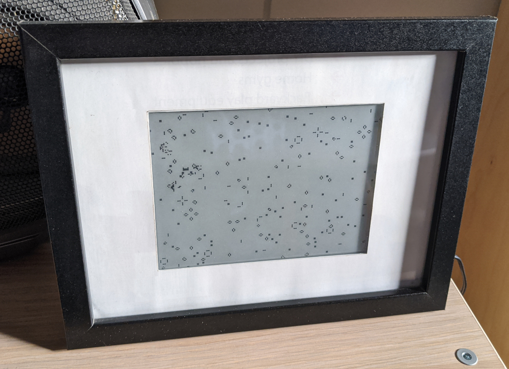

# Tarpit Game of Life

This Inkplate e-ink screen shows Conway's Game of Life, seeded from tarpits I have on the Internet.
The tarpits are programs on my computer that superficially look like insecure Telnet and Remote Desktop services, but actually exist to respond super slowly and make bots scanning the Internet 'get stuck'.

When a bot connects to the tarpit, the data it sends gets squished into an 8x8 grid and 'stamped' onto a Game of Life board.
Data from a bot at the IP address 1.1.x.x will get stamped on the top left corner, data from a bot at 254.254.x.x will get stamped on the bottom right corner.

Conway's Game of Life, a set of simple rules that govern whether cells should turn on or off, updates the display once per second.
The result is that bot attacks end up appearing as distinct 'creatures', that get bigger and more angry looking over time (as their centre is updated with new data). After the attack finishes, the 'creature' eventually burns itself out.

Despite that description, it's a really chill piece of art that doesn't draw too much attention but I can happily watch for a long time.

Credit for the idea goes to [xen0bit](https://github.com/xen0bit/botnet-fishbowl), I had been wanting to make a real-life version of XKCD #350 for years before seeing his Botnet Fishbowl project.

## I want one!

First, I don't recommend running this.

I've been messing around with tarpits on and off for almost 20 years, and one thing running them will definitely do is get the attention of random hackers who all of a sudden are wondering why all 256 of their bot's threads are stuck on the same IP for weeks at a time.

The ones I chose for this project are very simple and probably won't cause you much trouble, and I've been running them for about 3 years at this point with no dramas, but I can't guarantee that for you.

## I still want one!

You'll need a 6-inch Inkplate e-ink board, and a Linux server accessible from the Internet.

I've included Docker files to get you started, but you could just run the tarpit.py script as root on your server and open ports 23, 3389, and 2383.
You could also replace port "23" in tarpit.py with "2323" and forward port 23 to 2323 in your firewall, then you wouldn't need to run it as root.

Search through the TarpitGameOfLife.ino file for the keyword 'REPLACE' and change the values to fit your setup.

A different company is making Inkplates now so it's possible that this code might be incompatible with the new model.

## This code sucks!

Yeah, I never expected to release it.
If you want to fix it up to your standards, send me a pull request or just fork the whole thing I don't care.

The project is released as Copyright Zero, you don't need to credit me but if you do something cool I'd love to hear about it.
